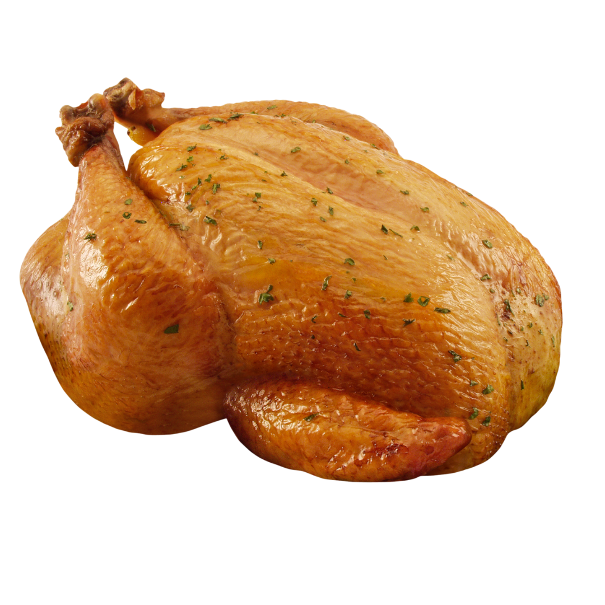
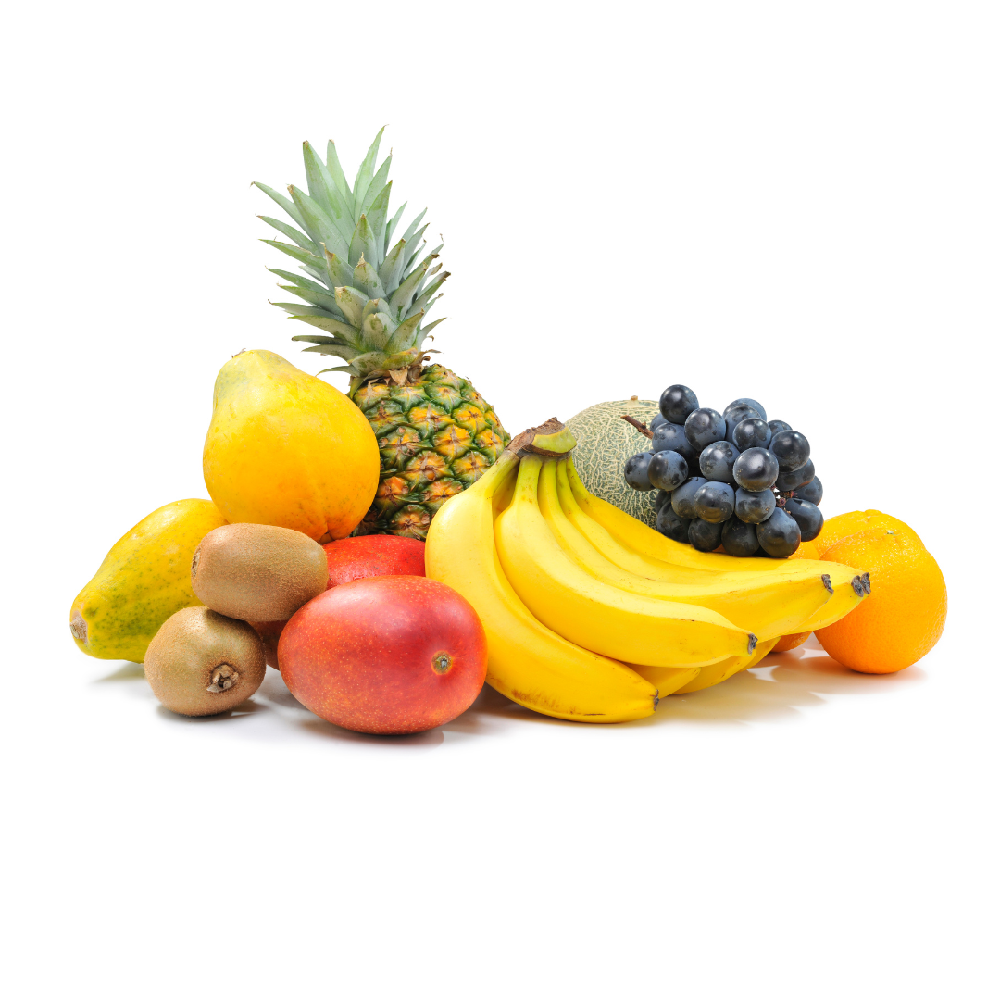
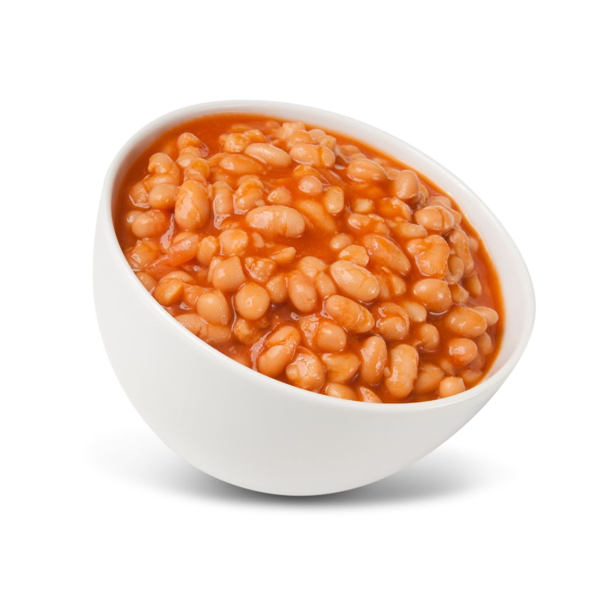
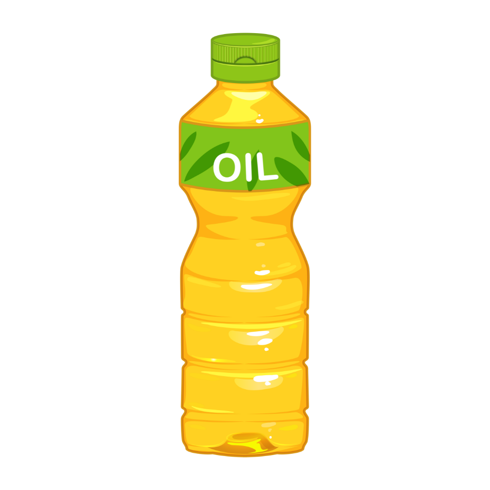
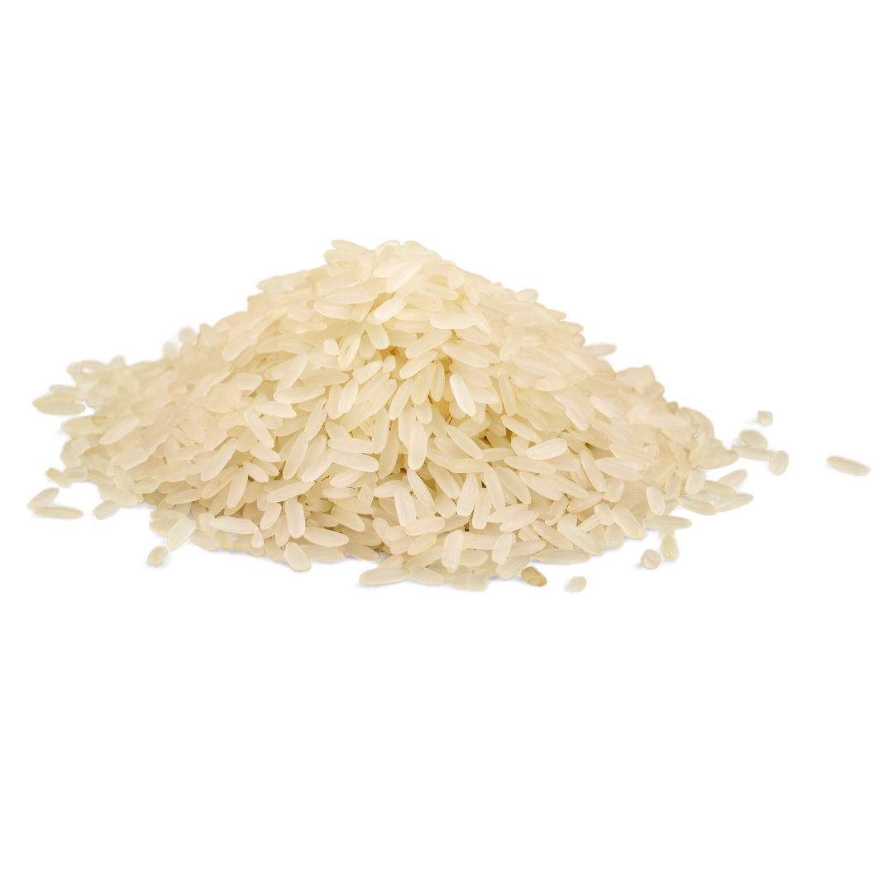
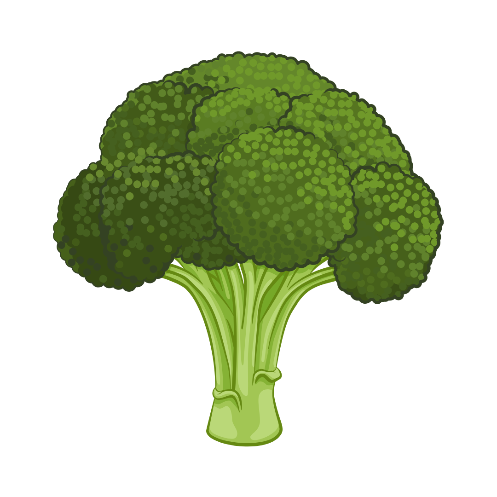
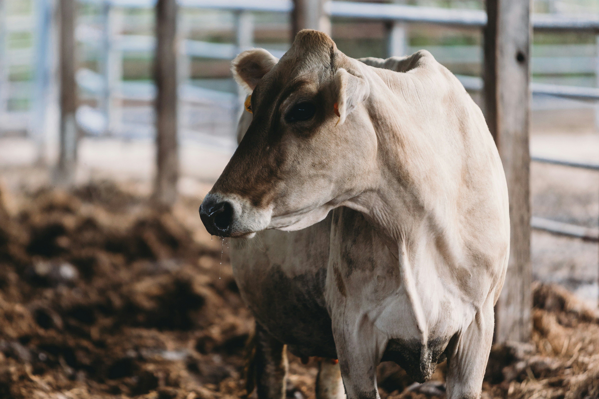

```js
// import csv file containing inflation rate - for food, core and general
const consumerPricesData = FileAttachment("data/inflation_data.csv").csv({ typed: true });
```

```js
// import csv file containing inflation rate - for food, core and general
const healthy_diet_table = FileAttachment("data/healthy_diet_table.csv").csv({ typed: true });
```

```js
// Create a custom parser for "MMM-YY" format, where Jan-09 becomes January 2009
const parseDate = d3.utcParse("%b-%y");
const formatDate = d3.timeFormat("%b, %Y");

// Format the data correctly for Plot
const formattedCPIData = consumerPricesData.map((d) => ({
  date: parseDate(d.month), // Parse dates from string
  type: d.type,
  rate: +d.rate, // Convert values to numbers
}));
```

```js
function plotInflationChart(data, { width } = {}) {
  return Plot.plot({
    width,
    color: { range: ["#FF9500", "#423942", "#36B81F"], legend: true },
    height: 350,
    y: { ticks: 4, grid: true, label: "Inflation Rate (%)" },
    marks: [
      Plot.ruleY([0]),
      Plot.line(data, {
        x: "date",
        y: "rate",
        z: "type",
        stroke: "type",
        strokeWidth: 1.75,
        tip: true,
        title: (d) => `Date: ${formatDate(d.date)} \n\nRate: ${d3.format(".0%")(+d.rate / 100)}`,
      }),
      Plot.crosshair(data, { x: "date", y: "rate" }),
    ],
  });
}
```

<div class="LN-index-hero-header LN-block-margin">
  <h1>Least Nutrify</h1>
  <p class="LN-block-subtitle">Least Nutrify empowers Nigerians to make healthier food choices by providing insightful data on nutrition, affordable recipes, and practical diet tips, all while exploring the economic and cultural dynamics of our food system.</p>
  <hr>
</div>

<div class="LN-hero-block-calories">
  <h2 class="LN-block-subheader">How Calories Stack Up in a Healthy Diet</h2>
  <p class="LN-block-subtitle">A detailed look at the energy contributions from food groups essential to balanced nutrition.</p>
  <div class="LN-block-fooditems-container">
    <div class="LN-block-fooditem">
      <div class="circle medium">
        
      </div>
      <div class="calories">300</div>
      <div class="label">Animal Sourced</div>
    </div>
    <div class="LN-block-fooditem">
      <div class="circle small">
        
      </div>
      <div class="calories">160</div>
      <div class="label">Fruits</div>
    </div>
    <div class="LN-block-fooditem">
      <div class="circle medium">
        
      </div>
      <div class="calories">300</div>
      <div class="label">Legumes</div>
    </div>
    <div class="LN-block-fooditem">
      <div class="circle medium">
        
      </div>
      <div class="calories">300</div>
      <div class="label">Oils and Fat</div>
    </div>
    <div class="LN-block-fooditem">
      <div class="circle large">
        
      </div>
      <div class="calories">1160</div>
      <div class="label">Starchy Food</div>
    </div>
    <div class="LN-block-fooditem">
      <div class="circle small">
        
      </div>
      <div class="calories">110</div>
      <div class="label">Vegetables</div>
    </div>
  </div>
  <hr>
</div>

<div class="LN-block-margin">
  <div class="LN-header-flex">
    <h2 class="LN-block-subheader">Tracking monthly inflation</h2>
    <p class="LN-block-subtitle"> Track Monthly Changes in Food, Core, and General Inflation Rates.</p>
  </div>
  <div  class="card card-chart">
    ${
        resize((width) => plotInflationChart(formattedCPIData)) 
      }
  </div>
  <hr>
</div>

<div class="LN-header-flex LN-block-margin">
  <h2 class="LN-block-subheader">What Makes a Healthy Diet Basket (HDB)?</h2>
  <p class="LN-block-subtitle"> Explore the key food groups, energy contributions, and portion sizes that define a globally comparable standard for affordable and nutritious diets.</p>
  <table class="card">
    <thead>
      <tr>
        <th>Food Group</th>
        <th>Number of Items</th>
        <th>Energy(Kcal)</th>
        <th>Calories Share</th>
        <th>Portion Sizes (g)</th>
      </tr>
    </thead>
    <tbody>
      <tr>
        <td>
        Starchy Staples</td>
        <td>2</td>
        <td>1160</td>
        <td>50%</td>
        <td>322g dry Rice</td>
      </tr>
       <tr>
        <td>
        
        Oil and Fats</td>
        <td>1</td>
        <td>300</td>
        <td>13%</td>
        <td>34g of Oil</td>
      </tr>
       <tr>
        <td> 
        Fruits</td>
        <td>2</td>
        <td>160</td>
        <td>7%</td>
        <td>230-300g</td>
      </tr>
       <tr>
        <td>
        
        Vegetables</td>
        <td>3</td>
        <td>110</td>
        <td>5%</td>
        <td>270-400g</td>
      </tr>
       <tr>
        <td>
        
        Legumes, Nuts and Seeds</td>
        <td>1</td>
        <td>300</td>
        <td>13%</td>
        <td>85g dry beans</td>
      </tr>
       <tr>
        <td>
        Animal Sourced Foods</td>
        <td>2</td>
        <td>300</td>
        <td>13%</td>
        <td>210g egg</td>
      </tr>
    </tbody>
  </table>
  <hr>
</div>

<div class="card-margin">
  <h2 class="LN-block-subheader">Uncover the Stories Behind Healthy Living</h2>
  <div class="grid grid-cols-3">
    <div>
      
      <p class="subparagraph"> How Agri-Financing Shortages Are Fueling Nigeria’s 2024 Food Crisis </p>
      <a class="read-more-button" href="https://leastnutrify.substack.com/p/bridging-the-gap-how-agritech-innovations"> read more </a>
    </div>
    <div>
      
      <p class="subparagraph"> Can Nigerian families afford rice? Exploring costly staples and nutritious alternatives </p>
      <a class="read-more-button" href="https://leastnutrify.substack.com/p/subsidy-removal-a-pain-the-ass"> read more </a>
    </div>
    <div>
      
      <p class="subparagraph"> Addressing nutritional gaps: the significance of Nigeria's newly established ministry for livestock development </p>
      <a class="read-more-button" href="https://leastnutrify.substack.com/p/addressing-nutritional-gaps-the-significance"> read more </a>
    </div>
</div>
  
</div>

<style>
main {
  overflow: hidden;
}

.LN-index-hero-header {
  display: flex;
  flex-direction: column;
  align-items: center;
  font-family: var(--serif);
  text-wrap: balance;
  text-align: center;
}

.LN-index-hero-header h1 {
  max-width: none;
  font-size: 14vw;
  margin-top: 4rem;
  font-weight: 900;
  line-height: 1;
  background: linear-gradient(90deg, rgba(212,222,69,1) 0%, rgba(84,164,22,1) 100%);
  -webkit-background-clip: text;
  -webkit-text-fill-color: transparent;
  background-clip: text;
}

.LN-index-hero-header p {
  margin: 0;
  max-width: 42em;
  font-family: var(--sans-serif);
  font-size: 14px;
  font-style: initial;
  font-weight: 400;
  line-height: 1.5;
  color: var(--theme-foreground-muted);
}

.LN-block-margin {
  margin: 1rem 0 2rem;
}

.LN-header-flex {
  display: flex;
  flex-direction: column;
  align-items: center;
}

.card-chart {
  max-width: 640px;
  margin: 0 auto;
}

.read-more-button {
  background: #EFD976;
  padding: 1rem;
  font-size: 1rem;
}

text {
  font-size: 14px;
  color: #666;
}

[aria-label="x-axis tick"], [aria-label="y-axis tick"] {
  stroke: #ccc;
}


.LN-hero-block-calories {   
  display: flex;
  flex-direction: column;
  justify-items: center;
  align-items: center;
  font-family: var(--sans-serif);
}

.LN-block-subheader {
  max-width: 100%;
  font-family: var(--serif-hd);
  font-size: 20px;
  margin-bottom: 5px;
  text-align: center;
}

.LN-block-subtitle {
  max-width: 380px;
  text-align: center;
  color: #666;
  font-size: 14px;
  margin: 0px;
  line-height: 1.275;
}

.subparagraph {
  font-size: 16px;
  color: #666;
}

.LN-block-fooditems-container {
  display: flex;
  justify-content: space-between;
  align-items: flex-end;
  gap: 8px;
  margin-bottom: 20px;
}

.LN-block-fooditem {
  display: flex;
  flex-direction: column;
  align-items: center;
  text-align: center;
}

.circle {
  background: white;
  border-radius: 50%;
  box-shadow: rgba(0, 0, 0, 0.3) 0px 19px 38px, rgba(0, 0, 0, 0.22) 0px 15px 12px;
  margin-bottom: 10px;
  display: flex;
  align-items: center;
  justify-content: center;
  overflow: hidden;
}

.calories {
  font-size: 14px;
  font-weight: bold;
  margin-bottom: 5px;
}

.label {
  font-size: 12px;
  color: #333;
}

/* Different circle sizes */
.circle.small {
  width: 16px;
  height: 16px;
}

.circle.medium {
  width: 26px;
  height: 26px;
}

.circle.large {
  width: 51px;
  height: 51px;
}

.circle img {
  width: 80%;
  height: 80%;
  object-fit: contain;
}

/* table css styling */
table {
  width: 100%;
  max-width: 640px;
  border-collapse: collapse;
  border: 1px solid #ddd;
  background-color: #fff;
  margin: 0 auto;
}

tbody td img {
    margin-right: 8px; /* Space between image and text */
    vertical-align: middle;
    border-radius: 50%; /* Optional: Makes the image circular */
}

th, td {
  padding: 12px;
  text-align: left;
  border-bottom: 1px solid #ddd;
}

th {
  font-weight: normal;
  color: #666;
  background-color: #f7f7f7;
}

td {
  font-size: 14px;
  color: #666;
}

td:first-child {
  color: #333;
  font-weight: bold;
}


/* Responsive styles */
@media (min-width: 640px) {
  .LN-index-hero-header h1 {
    font-size: 75px;
  }
  .LN-index-hero-header p {
    font-size: 16px;
  }
  .LN-block-subheader {
    font-size: 24px;
  }
  .LN-block-subtitle {
    font-size: 16px;
  }
  .LN-block-fooditems-container {
    gap: 2rem;
  }
  .label {
    font-size: 14px;
  }

}

@media (max-width: 768px) {
  table, th, td {
    font-size: 12px;
  }
}

@media (max-width: 480px) {
  table, th, td {
    font-size: 10px;
    padding: 8px;
  }
}  
</style>
